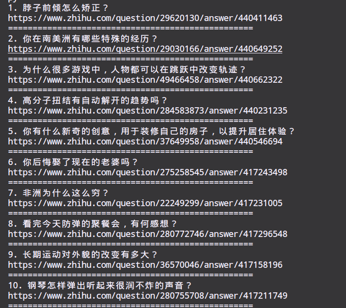

# 抓取知乎发现10条
---
1.    based on module requests（发送网络请求，抓取网页） and PyQuery（文档解析器）。
2.    抓取知乎explore的“今天最热”（默认10条）的标题和对应的URL, 并保存在txt中。（服务器返回的静态页面，没有继续抓取“更多”的这个AJAX请求）

# Screenshot:
---
### 1. 获取token，原因：

