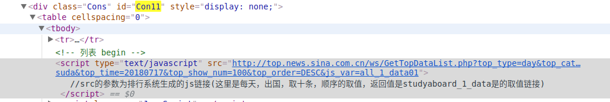
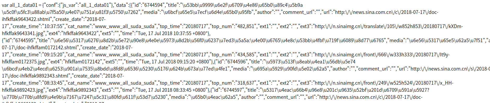
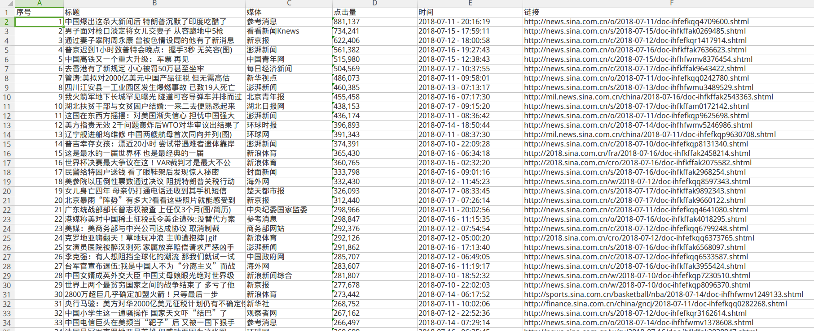

# 抓取新浪新闻中心新闻排行，按点击量排行
---
1.    based on module requests(发送网络请求，抓取网页), PyQuery(文档解析器), re(正则表达式), json(处理JSON字符串), openpyxl(Reading and writing excel).

# 遇到的问题:
---
### 1. 解决Requests抓取后乱码的办法
1.1  requests.get(url).encoding = 'utf-8'   设置编码

1.2  requests.get(url).content.decode('utf-8')    bytes -> str
### 2. 在返回的html文件中找到数据API（不用在Chrome debugger的Network中分析AJAX,即不用分析XHR对象）

### 3. 从API获取的数据是Unicode编码，要Unicode -> str，且要去除链接中多余的'\\'

### 4. API返回的数据是var xxx = {}是一个JS对象，里面包含全部新闻的JSON，每段新闻是一个JSON。用re库提取出来。
### 5. 提取出来后是JSON，type是str。所以要用json.loads将JSON字符串转换为Python字典对象，易于提取所要的信息。

### 6.成功

