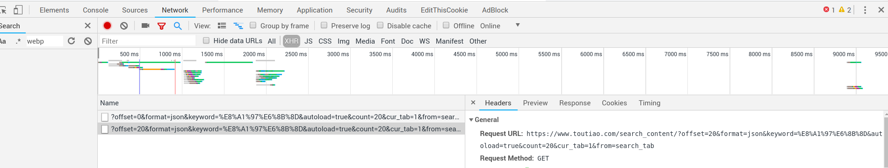
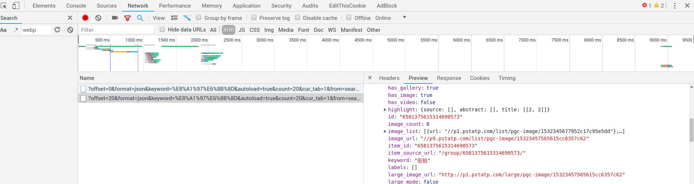
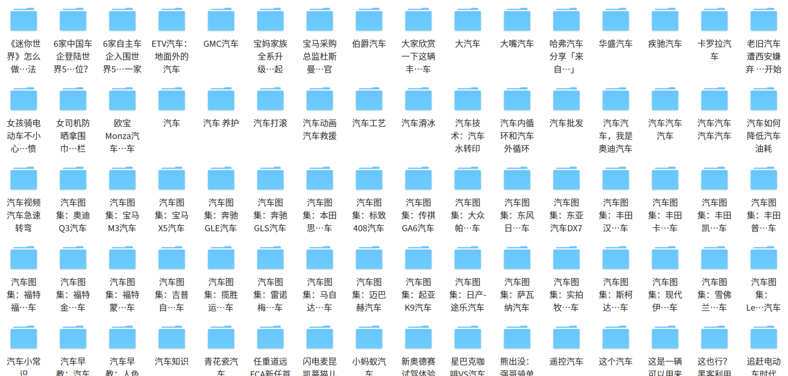

# 抓取今日头条的搜索栏
---
1.    based on module requests(发送网络请求，抓取网页). 不用解析库，因为从XHR中找到了返回JSON格式数据的API.
# 遇到的问题:
---
### 1. 从chrome debugger分析XHR找到获取JSON数据的URL，模仿这个URL的参数，即可获得数据。offset控制分页

### 2. 查看preview的data

### 3. 

