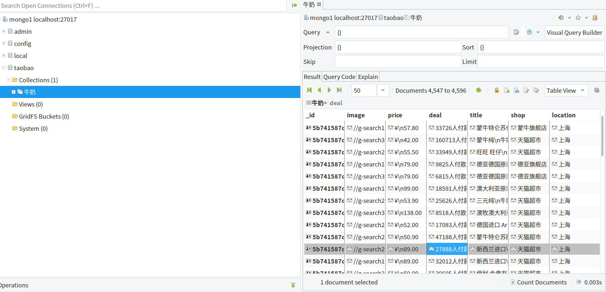

# 抓取淘宝商品列表
---
1.  selenium(本身也有选择器) + PyQuery + MangoDB 爬取淘宝商品。
2.  成功加载出某一页商品列表时，利用Selenium获取页面源代码，然后用PyQuery进行解析。(get_index()获取对应的页码，然后加载出对应页码的商品列表后，再去调用 get_products()方法进行页面解析)
3.  分析淘宝的接口XHR(AJAX)，有一大堆参数在请求那。手动构造这些参数的URL非常麻烦，所以用selenium来模拟浏览器行为，不再需要关注这些请求参数。

