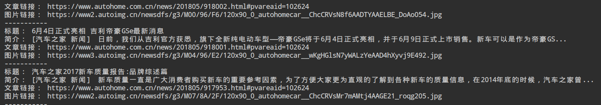
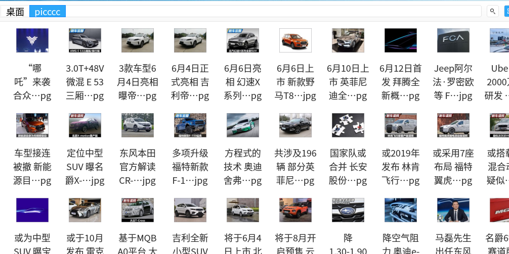

# spider on autohome(汽车之家)
> 1. My first Web spider based on module requests（发送网络请求） and BeautifulSoup（文档解析器）
> 2. 爬取新闻指定某个区域，获取标题，简介，文章链接，缩略图

# 缺点：
> 1. 只能爬取特定的区域，且下载的是缩略图，没有太大意义
> 2. 没有封装

Screenshot:

---

---
