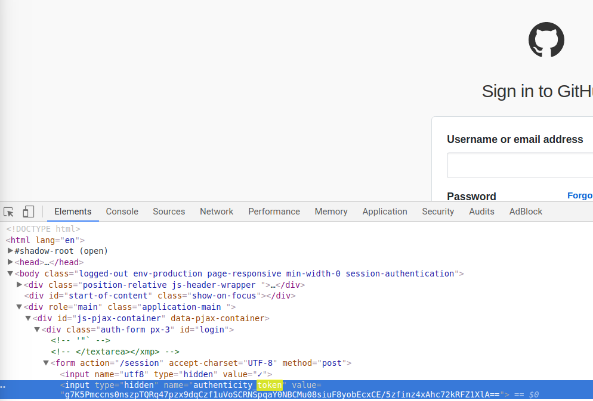
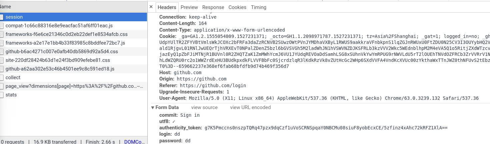
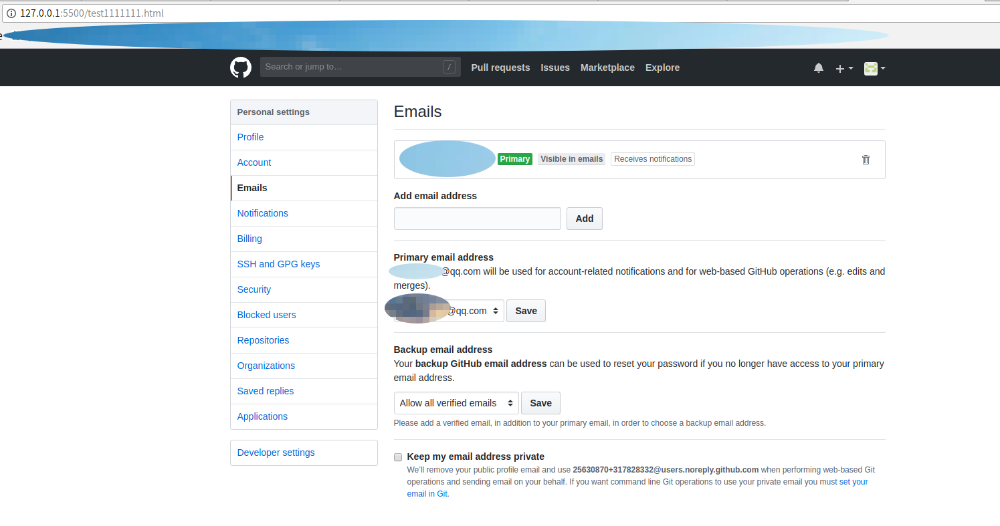

# 模拟浏览器登录github流程
> 1. based on module requests（发送网络请求，例如post请求，获取cookies等） and BeautifulSoup（文档解析器，获取token）
> 2. 获取所需信息，例如token，cookies，登录表单提交的数据，然后通过post请求模拟登录

Screenshot:
### 1. 获取token，原因：
> 1. https://www.cnblogs.com/allen2333/p/9125239.html。
> 2. 注意： 模拟浏览器登录github并不是进行CSRF攻击，只是需要带上所需的信息。例如token。
> 3. 另外：token是一种身份认证方式，可以防止CSRF攻击和防止表单重复提交等； https://www.cnblogs.com/allen2333/p/9124608.html

---

### 2. 查看除了token外其他必要的信息。
> 输入用户名和密码为dd，用chrome-debugger看看表单提交了什么数据。模拟程序里加入这些数据

---

### 3. 登录成功后，用live server本地查看返回的页面
